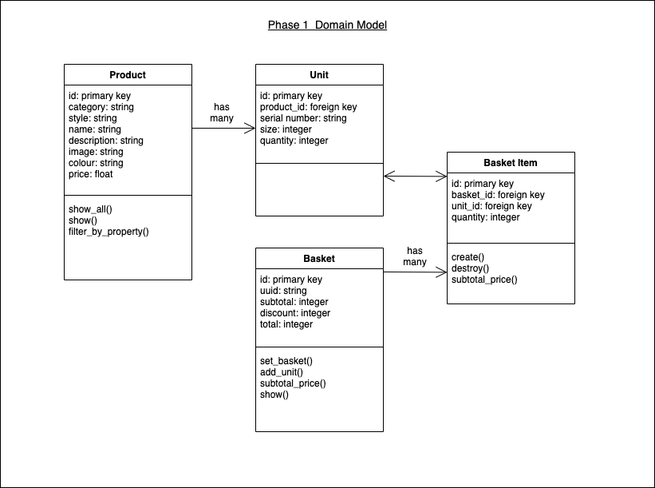
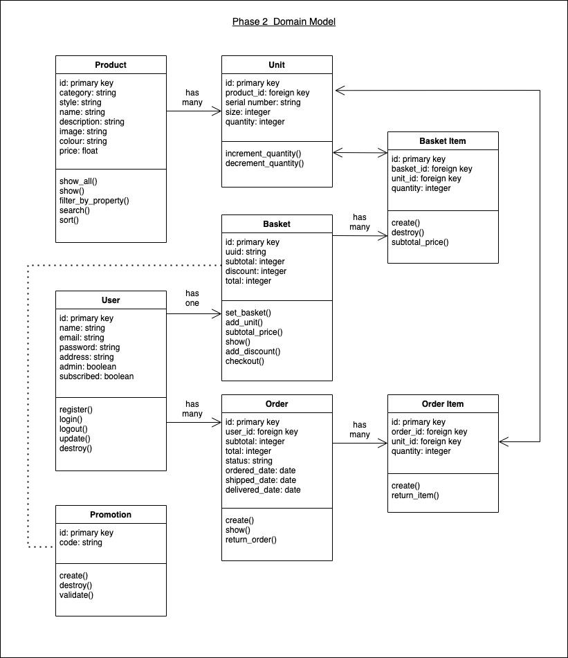

Golden Shoe
===================

[Requirements](#requirements) | [Getting Started](#getting-started) | [Dependencies](#dependencies) | [Running Tests](#running-tests) | [Deployment](#deployment) | [Criteria for Building the Project](#criteria-for-building-the-project)

## Requirements

A well-known British shoe company, Golden Shoe, has seen a steady decline in revenue
over the couple of years, and the newly appointed CEO and leadership team are ready to
confront digital disruption heads on. Golden Shoe make most of their revenue from their
stores, but they do have an online presence too.

They have a flagship store in London, however it is located next to their main competitor,
which seems to be much busier than the Golden Shoe store. Their e-Commerce platform
was built around 9 years ago, when most online interaction was done using a desktop.
Conversion rate has declined rapidly, and the dropout rates in mobile and ipad devices have
increased dramatically. Global Shoe have no mobile app. They have quarterly releases,
which works well, though it is impossible to get any small changes in quicker than this.
They are aware of the benefits of Agile but are concerned about how to upskill their current
loyal workforce, and convince the leadership team.

If customers have any issues, the only way they can get help is to phone the customer
service helpline between 9am-5pm Monday-Friday.

Top 3 reasons for contacting customer services;
- Returns process
- Items showing as in stock, but actually being out of stock (and the customer is still
able to ‘check out’ the item even though it is out of stock)
- Queries around delivery dates and time
Top reasons for returning items;
- Incorrect shoe size (38%)
- Didn’t like the shoe style (35%)
- Didn’t like the colour (19%)
- Other (8%)

They do have a social media presence, but their Twitter and Facebook accounts are both
unmonitored, and customers have the ability to share from all parts of the website.

The marketing department sends direct mail and catalogues to a list of customers whose
details they collected. This mail often consists of £10 off vouchers, which can only be used in
store.

The Task

As an AND Digital Associate, we want you to summarise;
- The challenges that Golden Shoe are facing
- The added value AND Digital can provide
- Present your recommendations in a presentation and coded out demo format. You
will need to bring this with you to your interview, as the Client will spend
approximately 20 minutes going over it with you

## Getting Started

Ensure you have the following setup on your machine:
- Bundler
- PostgreSQL
- Yarn

`git clone` this repository and `cd` into the directory.

Install dependencies:

```
$ bundle install
$ yarn install
```

Create, migrate and seed the database:

```
$ rails db:setup
```

To run the project, start up the server:

```
$ rails server
```

Then navigate to `localhost:3000` in your browser

## Dependencies

This project relies on the following Rails Gems:

- Devise (for user authentication)
- Material Icons
- Tailwind CSS

## Running Tests

This project is setup with:
- Capybara (feature tests)
- RSpec (controller and model tests)
- Rubocop (linting)
- SimpleCov (test coverage)

To run the tests:
```
$ bundle exec rspec
$ bundle exec rubocop
```

## Deployment

The app is deployed via Heroku here: [Golden Shoe](https://golden-shoe-shop.herokuapp.com/)

## Criteria for Building the Project

#### Methodology

The project is built with Rails, PostgreSQL, and Tailwind CSS.

Phase 1 (implemented):

I have prioritised the features that would be most impactful for conversion rate and increased revenue:

- Responsive design, built for mobile-first
- Home page with links to either men's or women's shoes
- Page listing all available products
- Filtering for products by category, style and colour
- Page for full product details
- Viewing a product's various different colours
- Selecting the appropriate size
- See whether product is in stock before purchase
- Add item to basket only if in stock
- View basket of selected items for purchase
- View basket total
- Remove item from basket

Phase 2:

- Product search and sort
- View orders and delivery status
- Sign up to newsletter for promotional deals
- Add promo code to checkout for discount
- Process online returns

Phase 3:

- Customer product reviews
- Customer wishlist
- Product recommendations based on current product
- “As seen on you” feature, allowing customers to submit own photos of products
- Social media share button
- Rotating banners with promotions and sales
- Abandoned cart notification
- Chatbot
- Improve Search Engine Optimisation

#### Domain Model

Domain model for completed MVP:


Domain model for proposed features:


#### User Stories (Phase 1)

```
As a user
So that I can view Golden Shoe's products
I would like to see a list of available products

As a user
So that I can view only the products I am interested in
I would like to filter products by category, style and colour

As a user
So that I can see more details about the product
I would like to see a full product page with description

As a user
So that I can choose a different colour of the same product
I would like an option to see the available colours

As a user
So that I can choose the correct shoe size
I would like an option to choose the size of the shoe

As a user
So that I can only purchase an item that is in stock
I would like to see whether the selected item is in stock

As a user
So that I can add purchase an item
I would like to add an item to my basket

As a user
So that I can amend my purchase
I would like to remove an item from my basket

As a user
So that I can confirm my final purchase
I would like to see the subtotal of my basket
```
